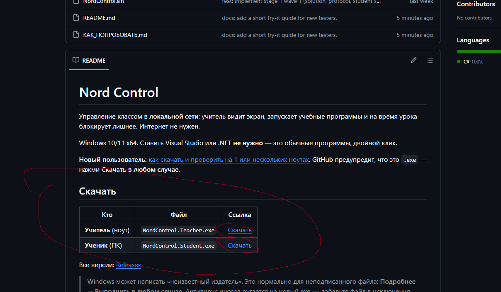

# Nord Control — как скачать и проверить

Это программа для **класса в локальной сети**: учитель видит экран ученика, запускает учебные программы и на время урока блокирует лишнее (игры, браузер и т.п.). Интернет не нужен — достаточно одной Wi‑Fi или кабеля.

Две роли, два файла:

- **Teacher** (`NordControl.Teacher.exe`) — окно учителя: PIN класса, список учеников, экран выбранного, запуск и запрет программ.
- **Student** (`NordControl.Student.exe`) — агент на ПК ученика: узкая плашка сверху + иконка в трее.

Visual Studio и .NET ставить **не нужно**. Windows 10/11 x64, двойной клик. Исходники в репозитории можно не открывать.

Репозиторий: [Lew1x-swaga/Nord_control_test](https://github.com/Lew1x-swaga/Nord_control_test)

---

## 1. Куда листать и что нажать

1. Открой ссылку выше. Это главная страница GitHub: сверху список файлов, ниже текст README.
2. **Не заходи в папки `src/` и `docs/`.** Листай README вниз до заголовка **Скачать** — там таблица с двумя синими ссылками **Скачать**.
3. Скачай **оба** файла: учитель и ученик.

Куда жать (обведено красным):

Прямые ссылки, если удобнее сразу:

| Роль | Файл | Ссылка |
|---|---|---|
| Учитель | `NordControl.Teacher.exe` | [скачать](https://github.com/Lew1x-swaga/Nord_control_test/releases/latest/download/NordControl.Teacher.exe) |
| Ученик | `NordControl.Student.exe` | [скачать](https://github.com/Lew1x-swaga/Nord_control_test/releases/latest/download/NordControl.Student.exe) |

**GitHub предупредит, что это исполняемый файл (.exe).** Так и задумано. Нажми **Download anyway / Скачать в любом случае** — иначе файл не сохранится.

После этого Windows может написать «неизвестный издатель» / SmartScreen. Это нормально для неподписанного файла: **Подробнее → Выполнить в любом случае**.

---

## 2. Один ноутбук (быстрый тест)

Можно гонять учителя и ученика на одной машине.

1. Скачай **оба** exe (см. предупреждение выше — жми «скачать в любом случае»).
2. Запусти **Teacher** → **Начать класс**. Если спросит брандмауэр — разреши **частные сети**. Запомни PIN (6 символов).
3. Запусти **Student** на том же ноуте → введи PIN → **Подключиться**.
4. Слева у учителя появится ученик. Клик — живой экран. Дальше можно запускать и запрещать программы.

Ученик — узкая плашка сверху, учитель — отдельное окно. Оба остаются на одном экране.

---

## 3. Несколько ноутбуков (как в классе)

1. Все машины в **одной Wi‑Fi** (или одном кабеле).
2. На ноуте учителя — только **Teacher** → **Начать класс** → PIN.
3. На каждом ученике — **Student**, тот же PIN → **Подключиться**.
4. Ученик появится в списке слева. Клик — экран этого ПК.

Если класс не находится: у ученика **Указать IP учителя…** и IPv4 ноута учителя (`ipconfig` на машине учителя).

---

## 4. Что смотреть

- Живой экран выбранного ученика (без мыши и клавиатуры).
- Список окон/процессов справа.
- Запуск учебной программы и блоклист на время урока.
- **Завершить класс** у учителя — запреты снимаются сразу, ПК снова обычный.
- Крестик у ученика **не выходит из урока** — окно уходит в трей. Выход: трей → **Покинуть урок** или **Выйти из программы**.

Закрыл Teacher или Student — блокировок в системе не остаётся. После перезагрузки агент сам не стартует.
